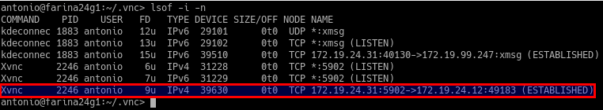
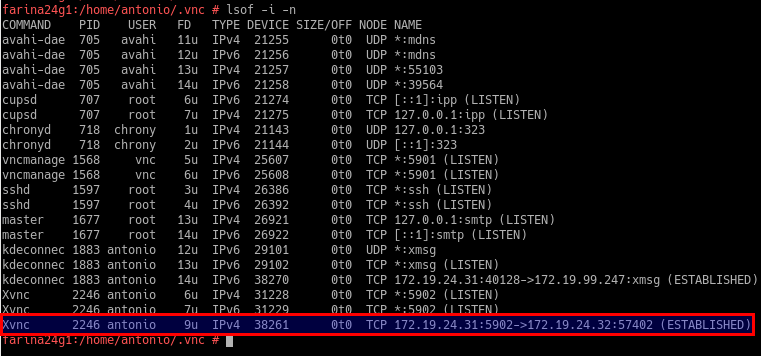

# A1: Acceso remoto VNC

* Comprobación de Cliente Windows -> Servidor Windows

* Comprobación de Cliente Linux -> Servidor Windows

* Comprobación de Cliente Windows -> Servidor Linux

* Comprobación de Cliente Linux -> Servidor Linux

