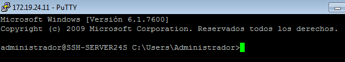

# A2: Acceso remoto con SSH

| Función | Sistema Operativo | IP | Nombre |
| ------- |------------------ | -- | ------ |
| Un servidor SSH| GNU/Linux OpenSUSE | 172.19.24.31 | ssh-server24g |
| Un cliente SSH | GNU/Linux OpenSUSE | 172.19.24.32 | ssh-client24g |
| Un servidor SSH | Windows Server| 172.19.24.11 | ssh-server24s |
| Un cliente SSH | Windows7 | 172.19.24.12 | ssh-cliente4w |

## 2.2 Primera conexión SSH GNU/Linux

Desde el cliente *ssh-client24g* comprobamos la conectividad con el servidor *ssh-server24g* mediante un ping.

Y también comprobamos que el servidor tiene el puerto 22 (puerto del ssh) abierto.

Tras esto nos conectamos mediante ssh al servidor desde nuestro cliente.

En el fichero *$HOME/.ssh/known_hosts* podemos ver la clave de identificación del servidor.

## 3.2 Comprobamos (Cambiar la identidad del servidor)

Después de definir que solo utilizaremos las claves RSA y regenerar las claves públicas/privadas de nuestro servidor, comprobamos que sucede si nos conectamos desde nuestros dos clientes.

Como resultado nos da un **WARNING** avisando de que la identificación del host ha cambiado y que podemos ser víctimas de algún ataque.

Para solucionar esto y que nos deje conectar al servidor:

* En Windows simplemente clickamos en ***Sí***, aceptando la nueva clave.

* En Linux debemos utilizar el siguiente comando para borrar la clave antigua y poder acceder de nuevo.
> ssh-keygen -R ssh-server24g -f $HOME/username/.ssh/known_hosts

## 5. Autenticación mediante claves públicas

Lo primero será generar un nuevo par de claves para nuestro usuario con el comando:
> ssh-keygen -t rsa

Estas claves se generarán en los ficheros:
* */home/username/.ssh/id_rsa*
* */home/username/.ssh/id_rsa.pub*

Ahora copiaremos la clave pública (*id_rsa.pub*) al fichero "*authorized_keys*" del usuario remoto *farina4* en el servidor con el comando:
>ssh-copy-id farina4@ssh-server24g

Si ahora tratamos de acceder con este usuario desde ambos clientes veremos que:

* Desde *ssh-client24g* no pide contraseña.

* Desde *ssh-client4w* pide contraseña.

## 6. Uso de SSH como túnel para X

Instalamos una aplicación de entorno gráfico que no este en los clientes, en mi caso *Geany*.

Modificamos el servidor para premitir ejecuta aplicaciones gráficas, esto se hace descomentando la linea *X11Forwarding yes* en el fichero */etc/ssh/sshd_config*.

Ahora en el cliente, comprobamos que no tenemos el *Geany* instalado.

Para terminar nos conectamos vía ssh al servidor con el parámetro ***-X*** para poder ejecutar la aplicación desde el servidor.

## 8.1 Restricción sobre un usuario

Lo siguiente será crear una restricción de uso del SSH para el usuario *farina2*.

Modificamos el fichero ***/etc/ssh/sshd_config*** añadiendo la linea *DenyUsers* seguida del nombre de los usuarios a denegar.

Si probamos a entrar al servidor vía SSH con el usuario *farina2* nos denegará el permiso.

## 9. Servidor SSH en Windows

Configuramos un Windows Server y añadimos los clientes en el fichero ***C:\Windows\System32\drivers\etc\hosts***.

Comprobamos la conexión con ambos equipos median un ping.

Ahora instalamos el servidor SSH en windows utilizando en la *powershell* (como administrador) el comando:
> Falta comando del campus

Comprobamos el acceso SSH desde los clientes.

* Linux

* Windows

