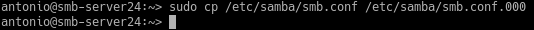
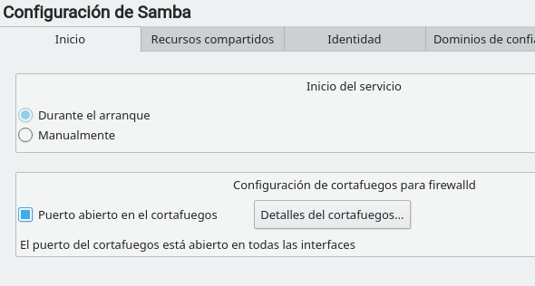
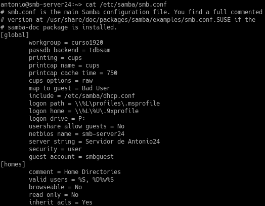
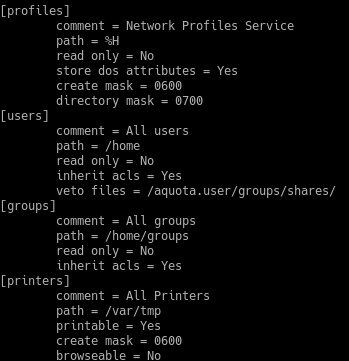
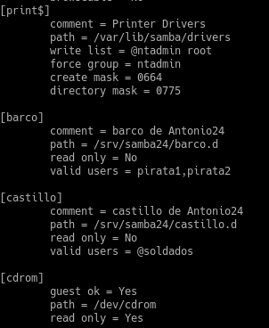
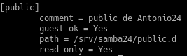

# Ssamba (con OpenSUSE y Windows)

| Secciones |
|-----------|
| **(1.4 y 1.5) Fichero smb.conf** |
| **(2.1 y 2.2) Conexión SMB desde Windows** |
| **(3.1 y 3.2) Conexión SMB desde GNU/Linux** |
| **(3.3) Montaje automático** |

---

### 1.4 Configurar el servidor Samba

Realizamos una copia de seguridad del fichero de configuración existente.

Y desde *Yast -> Servidor Samba* asignamos el grupo de trabajo.

En la siguiente ventana marcamos el inicio del servicio durante el arranque de la máquina y abrimos los puertos en el cortafuegos.

### 1.5 Crear los recursos compartidos de Samba

Desde *Yast -> Servidor Samba -> Recursos compartidos* añadimos las secciones global, cdrom, public, barco y castillo.

### 2.1
