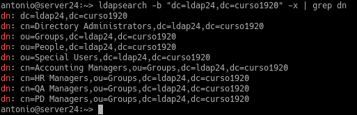
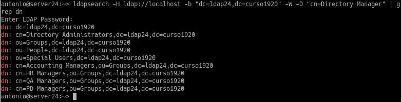
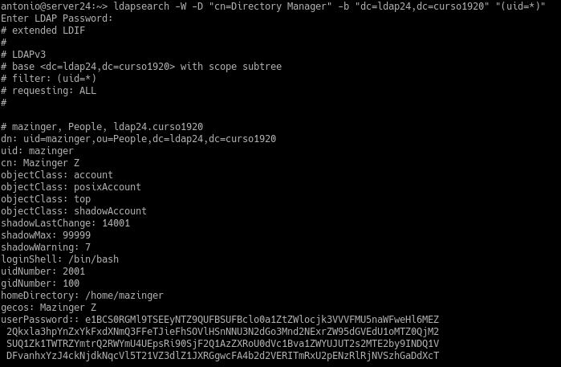
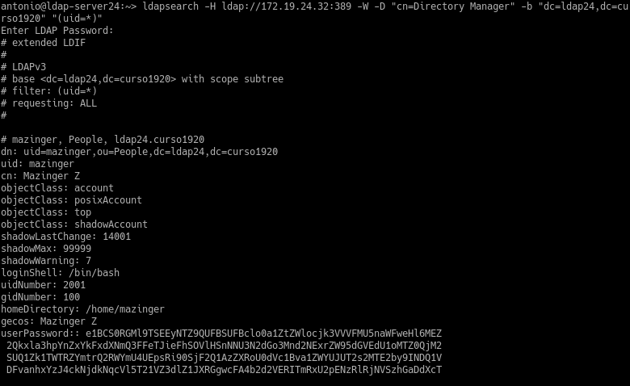
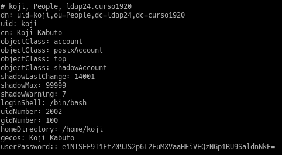
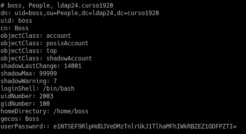
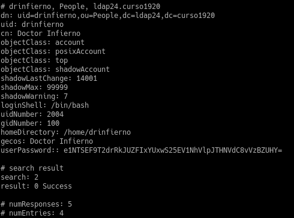

# Servidor 389-DS - OpenSUSE

| Sección |
| ------- |
| (2.3) Comprobar contenido del DS LDAP |
| (3.3) Comprobar nuevo usuario |
| (4.3) Comprobar los usuarios creados |

---

### (2.3) Comprobar contenido del DS LDAP

* Comprobamos el contenido de nuestra base de datos LDAP
>ldapsearch -b "dc=ldap24,dc=curso1920" -x | grep dn

* Realizamos la misma comprobación pero utilizando usuario/clave
>ldapsearch -H ldap://localhost -b "dc=ldap24,dc=curso1920" -W -D "cn=Directory Manager" | grep dn

### (3.3) Comprobar nuevo usuario

* Comprobamos la creación del usuario *Mazinger Z*

### (4.3) Comprobar los usuarios creados

* Desde una máquina cliente comprobamos los usuarios creados
> ldapsearch -H ldap:172.19.24.32:389 -W -D "cn=Directory Manager" -b "dc=ldap24,dc=curso1920" "(uid=\*)"

