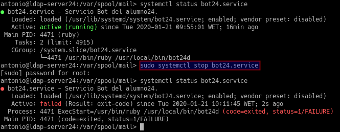
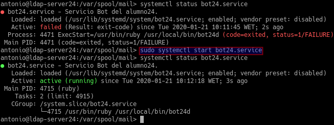
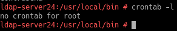
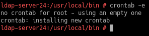
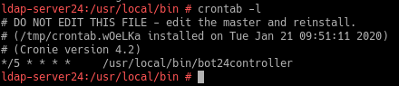

# P2: Servicio de comunicaciones con Telegram (bot-service)

| ID  | Criterio |
| --- | -------- |
| 1.4 | Entrega  |
| 2.4 | Entrega  |
| 3.2 | Tareas programadas |

## 1.4 Entrega

**Fichero [bot.service](files/bot24d):**

```ruby
#!/usr/bin/env ruby

require 'telegram/bot'

# token:
# 1. Write your TOKEN value into "token" variable or
# 2. Create a local file "hiden.token" with your TOKEN value inside
token = '994565282:AAGeWy5H97ZBHZk2hcjieF-njw8H3-Jk1WY'
bot_username = '@antonio24_bot'

puts "[INFO] Running bot #{$0}..."

Telegram::Bot::Client.run(token) do |bot|
  bot.listen do |message|
    puts " => #{message.text}"
    campos = message.text.split(" ")
    if message.text == "/hello"
      bot.api.send_message(chat_id: message.chat.id, text: "Hello Word!")
    elsif message.text == "/byebye"
      bot.api.send_message(chat_id: message.chat.id, text: "Bye bye!")
    elsif message.text == "/ip"
      out = `ip a | grep "global eth0"`.split
      bot.api.send_message(chat_id: message.chat.id, text: "#{out[1]}")
    elsif message.text == "/mem"
      out = `free`
      bot.api.send_message(chat_id: message.chat.id, text: "#{out}")
    elsif campos[0] == "/ls"
      out = `ls #{campos[1]}`
      bot.api.send_message(chat_id: message.chat.id, text: "#{out}")
    elsif message.text == "/pwd"
      out = `pwd`
      bot.api.send_message(chat_id: message.chat.id, text: "#{out}")
    elsif campos[0] == "/crear"
      text = campos[2,campos.size].to_s
      `echo #{text} > #{campos[1]}`
    elsif campos[0] == "/ver"
      out = `cat #{campos[1]}`
      bot.api.send_message(chat_id: message.chat.id, text: "#{out}")
    end
  end
end
```

**URL vídeo: https://youtu.be/gjKgxfeu3s0**


## 2.4 Entrega

**Fichero [bot.service](files/bot24.service):**

```
[Unit]
Description=Servicio Bot del alumnoXX.
After=network.service

[Service]
Type=simple
ExecStart=/usr/bin/ruby /usr/local/bin/botXXd

[Install]
WantedBy=multi-user.target

```

* Paramos el servicio y comprobamos el estado



* Iniciamos el servicio y comprobamos el estado




# 3.2 Tareas programadas

Iniciamos sesión como usuario ***root*** puesto que las tareas se guardan por usuarios.

Con ***crontab -l*** vemos las configuraciones creadas.



Ejecutando ***crontab -e*** se nos abre un editor donde escribir nuestra tarea.



Comprobamos que la tarea ha sido creada.


