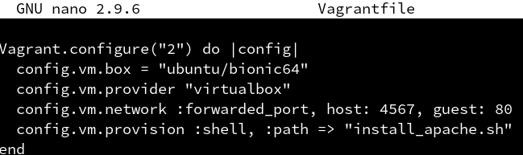
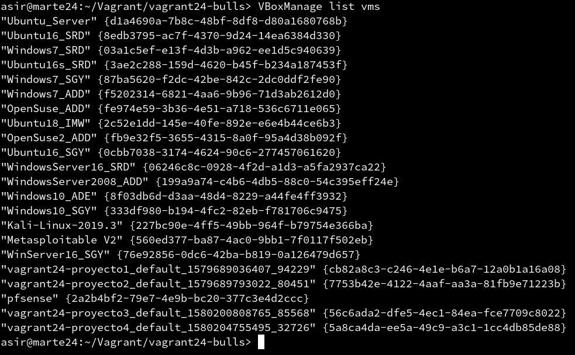

# P1: Vagrant con VirtualBox

| Sección               |
| --------------------- |
| (3.3) Comprobar proyecto 1    |
| (5.2) Comprobar proyecto 2    |
| (6.1) Suministro Shell Script |
| (6.2) Suministro Puppet       |
| (7.2) Crear Box Vagrant       |


## 3.3 Comprobar proyecto 1

Dentro de la carpeta *vagrant24-proyecto1* ejecutamos *vagrant up*.

```
asir@marte24:~/Vagrant/vagrant24-proyecto1> vagrant up
Bringing machine 'default' up with 'virtualbox' provider...
==> default: Importing base box 'ubuntu/bionic64'...
==> default: Matching MAC address for NAT networking...
==> default: Checking if box 'ubuntu/bionic64' version '20200121.0.0' is up to date...
==> default: Setting the name of the VM: vagrant24-proyecto1_default_1579689036407_94229
==> default: Clearing any previously set network interfaces...
==> default: Preparing network interfaces based on configuration...
    default: Adapter 1: nat
==> default: Forwarding ports...
    default: 22 (guest) => 2222 (host) (adapter 1)
==> default: Running 'pre-boot' VM customizations...
==> default: Booting VM...
==> default: Waiting for machine to boot. This may take a few minutes...
    default: SSH address: 127.0.0.1:2222
    default: SSH username: vagrant
    default: SSH auth method: private key
    default: Warning: Connection reset. Retrying...
    default: Warning: Remote connection disconnect. Retrying...
    default:
    default: Vagrant insecure key detected. Vagrant will automatically replace
    default: this with a newly generated keypair for better security.
    default:
    default: Inserting generated public key within guest...
    default: Removing insecure key from the guest if it's present...
    default: Key inserted! Disconnecting and reconnecting using new SSH key...
==> default: Machine booted and ready!
==> default: Checking for guest additions in VM...
    default: The guest additions on this VM do not match the installed version of
    default: VirtualBox! In most cases this is fine, but in rare cases it can
    default: prevent things such as shared folders from working properly. If you see
    default: shared folder errors, please make sure the guest additions within the
    default: virtual machine match the version of VirtualBox you have installed on
    default: your host and reload your VM.
    default:
    default: Guest Additions Version: 5.2.34
    default: VirtualBox Version: 6.0
==> default: Mounting shared folders...
    default: /vagrant => /home/asir/Vagrant/vagrant24-proyecto1
asir@marte24:~/Vagrant/vagrant24-proyecto1>
```

Una vez se ha iniciado la máquina, nos conectamos a ella mediante SSH utilizando el comando **vagrant ssh**.


## 5.2 Comprobar proyecto 2

Para comprobar que hay un servicio a la escucha en el puerto 4567, abrimos una consola en la máquina real y ejecutamos **vagrant port**.


También podemos abrir la URL http://127.0.0.1:4567 en el navegador, accediendo así al puerto 80 y comprobando que el servicio **apache** funciona.


## 6.1 Suministro Shell Script

Creamos el directorio *vagrant24-proyecto3* y dentro un proyecto Vagrant.


Creamos el script *install_apache.sh* y añadimos lo siguiente:


Le damos al script permisos de ejecución.


Indicamos a Vagrant que debe ejecutar el script dentro del entorno virtual, para esto añadimos a Vagrantfile las siguientes lineas.



Creamos la máquina.


Si nos fijamos, durante la instalación veremos como se instalan los paquetes necesarios.


Debido al funcionamiento del script, es fichero **index.html** es creado en */var/www/index.html* y debería de estar en */var/www/html/index.html*, por lo que de manera provisional moveremos el archivo a esta ruta y todo funcionará correctamente


## 6.2 Suministro Puppet

Creamos el directorio *vagrant24-proyecto4* y un nuevo proyecto.


Modificamos el fichero Vagrantfile de la siguiente forma.


Y creamos el fichero *manifests/default.pp* con las órdenes puppet para instalar el programa deseado.


Levantamos la máquina y nos conectamos a ella para instalar el paquete **Puppet**.


Luego recargamos la configuración con ***vagrant reload*** y volvemos a ejecutar la provisión ***vagrant provision***, con esto ya se habrá instalado el paquete.


## 7.2 Crear Box Vagrant

Creamos una carpeta *vagrant24-bulls* para el proyecto.


Elegimos la máquina que queremos para crear nuestra propia caja, para ello podemos ver los nombres de estas con el comando: *VBoxManage list vms*.



Nos aseguramos de que la máquina está apagada y ejecutamos *vagrant package --base VMNAME package.box* para crear nuestra caja.


Comprobamos que se ha creado el fichero *package.box*


Añadimos la caja que hemos creado al repositorio local de cajas de vagrant con *vagrant box add nombre-alumnoXX/bulls package.box*.


Y consultamos la lista de cajas para comprobar que ha sido añadida.


