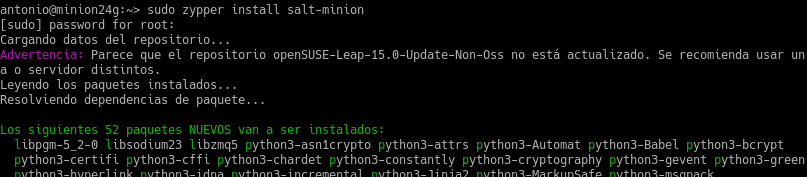
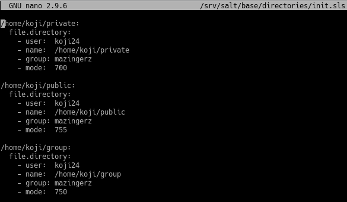

# P2: Salt stack

## 1. Preparativos

| Config   | MV1           | MV2          |
| -------- | ------------- | ------------ |
| Alias    | Master        | Minion       |
| Hostname | master24g     | minion24g    |
| SO       | OpenSUSE      | OpenSUSE     |
| IP       | 172.19.24.31  | 172.19.24.32 |

Configuramos también el fichero */etc/hosts* con "IP nombre" de ambas máquinas.

## 2. Master: instalar y configurar

Instalamos el software master ejecutando *zypper install salt-master*.

Modificamos el fichero */etc/salt/master* para configurarlo de la siguiente manera:

Activamos el servicio en el arranque del sistema.

Y lo iniciamos.

Por último consultamos los minions aceptados, por ahora ninguno.

## 3. Minion

### 3.1 Instalación y configuración

Instalamos el software del agente ejecutando *zypper install salt-minion*.

Modificamos el fichero */etc/salt/minion* para definir quien será nuestro master.

Activamos el servicio en el arranque del sistema y lo iniciamos.

Comprobamos que **apache2** no está instalado.

### 3.2 Aceptación desde el Master

Vemos que el Master a recibido la petición.

La aceptamos con *salt-key -a minion*.

Y comprobamos que ha sido aceptado.

### 3.3 Comprobar conectividad

Comprobamos la conectividad desde el Master.

## 4. Salt States

### 4.1 Preparar el directorio para los estados

Creamos los siguientes directorios y ficheros.

El contenido del fichero será:

Y reiniciamos el servicio.

### 4.2 Crear un nuevo estado

Creamos el fichero */srv/salt/base/apache/init.sls*:

### 4.3 Asociar Minions a estados

Creamos el fichero */srv/salt/base/top.sls* donde asociamos a todos los Minions con el estado que hemos creado.

### 4.4 Comprobar: estados definidos

Consultamos los estados con el comando:

### 4.5 Aplicar el nuevo estado

Consultamos los estados en detalle y verificamos que no hay errores.

Aplicamos el estado en todos los minions.

Y comprobamos en el Minion que apache ha sido instalado.

## 5. Crear más estados

### 5.1 Crear estado "users"

Creamos el directorio */srv/salt/base/users* y el fichero */srv/salt/base/users/init.sls* con el siguiente contenido:

Y aplicamos el estado.

Como podemos ver en el cliente, se han creado correctamente.

### 5.2 Crear estado "directories"

Creamos el directorio */srv/salt/base/directories* y el fichero */srv/salt/base/directries/init.sls* con el siguiente contenido:

Y aplicamos el estado.

Comprobamos en el cliente que las carpetas se han creado adecuadamente.

## 6. Añadir Minion de otro SO

Instalamos *salt-minion* en una máquina Windows, introduciendo los campos requeridos durante la instalación.

Al acabar de instalar nos da la opcion de iniciar el servicio, pero también podemos iniciarlo desde una consola como administrador ejecutando *sc start salt-minion*.

Ahora comprobamos en el servidor las peticiones pendientes.

Aceptamos al nuevo minion.

Y comprobamos que ha sido aceptado.

