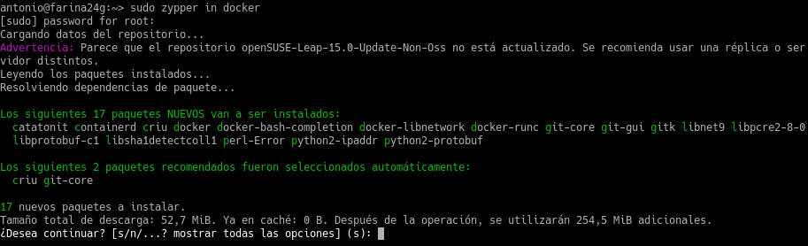
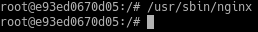
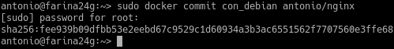
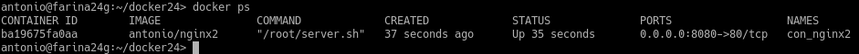

# P3: Docker

## 1. Contenedores con Docker

### 1.1 Requisitos

Usaremos una MV OpenSuse, asegurándonos de que su versión de Kernel es 3.10 o superior. (*uname -a*)

### 1.2 Habilitar el acceso a la red externa a los contenedores

Para conseguir esto, debemos activar la opción **IP_FORWARD** (*net.ipv4.ip_forward*). Para esto vamos a *Yast -> Ajuster de red -> Encaminamiento -> Habilitar reenvío de IPv4*.

Tras esto reiniciamos el equipo para aplicar los cambios.

## 2. Instalación y primeras pruebas

Ejecutamos todos los comandos con permisos de superusuario.

### 2.1 Instalación

Lo primero es instalar docker: **zyper in docker**

Una vez instalado iniciamos el servicio: **systemctl tart docker**

Para ver información mas detallada ejecutamos: **docker version**

### 2.2 Primera prueba

Para ver que todo funciona comprobamos las imágenes descargadas (ninguna) con: **docker images**

Y lo mismo para los contenedores: **docker ps -a**

Para la primera prueba descargaremos y ejecutaremos un contenedor con la imagen "hello-world".

* Vemos la nueva imagen: **docker images**

* El contenedor está en estado "Exited"

* Paramos el contenedor: **docker stop IDContainer**

* Y lo eliminamos: **docker rm IDContainer**

## 3. Creación manual

### 3.1 Crear una imagen manualmente

* Vemos las imágenes disponibles localmente: **docker images**

* Buscamos en los repositorios de Docker Hub contenedores con la etiqueta 'debian': **docker search debian**

* Descargamos una imagen 'debian' en local: **docker pull debian**

* Comprobamos que esta en la lista:

* Para ver todos los contenedores: **docker ps -a**
* Para ver sólo los contenedores en ejecución: **docker ps**

Ahora vamos a crear un contenedor con nombre *con_debian* a partir de la imagen *debian*, y ejecutaremos */bin/bash*:
**docker run --name=con_debian -i -t debian:9 /bin/bash**

### 3.2 Personalizar el contenedor

Ahora que estamos dentro del contenedor vamos a personalizarlo:

**Instalar aplicaciones dentro del contenedor**

* Comprobamos que estamos en Debian:

* Actualizamos los repositorios: **apt-get update**

* Instalamos nginx:

* Instalamos editor vi:

**Crear un fichero HTML**  holamundo.html

* Creamos el fichero:

* Ejecutamos el servicio nginx:

**Crear un script**

* Creamos el script */root/server.sh* con el contenido:

* Y le damos permisos de ejecución.

### 3.3 Crear una imagen a partir del contenedor

Abrimos una terminal y creamos la nueva imagen a partir del CONTAINERID con el comando **docker commit con_debian nombre-del-alumno/nginx**

Comprobamos que se ha creado.

### 3.4 Limpiamos

Eliminamos el contenedor:

* Paramos el contenedor: **docker stop con_debian**

* Eliminamos el contenedor: **docker rm con_debian**

* Comprobamos: **docker ps -a**

## 4.Crear contenedor a partir de nuestra imagen

### 4.1 Crear contenedor con Nginx

Iniciamos el contenedor a partir de la imagen creada anteriormente.

### 4.2 Comprobamos

En otra terminal ejecutamos **docker ps** para ver los contenedores en ejecución, y el puerto que utiliza.

Ahora abrimos un navegador y ponemos la URL 0.0.0.0:32768 para conectarnos el Nginx que el contenedor está ejecutando.

Comprobamos el acceso a *holamundo.html*

Con esto hemos terminado esta parte, así que paramos el contenedor y lo eliminamos.

### 4.3 Migrar la imagen a otra máquina

Exportamos la imagen Docker a fichero tar:

Intercambiamos la imagen con un compañero de clase y la importamos:

Y comprobamos que la imagen está disponible.

## 5. Crear un contenedor a partir de un Dockerfile

Vamos a conseguir lo mismo que en el apartado anterior pero usando un fichero de configuración.

### 5.1 Preparar ficheros

Creamos el directorio */home/antonio/docker24* y dentro ponemos los fichero *holamundo.html* y *server.sh* creados anteriormente.

También creamos el fichero *Dockerfile* con el contenido:

### 5.2 Crear imagen a partir del Dockerfile

El fichero Dockerfile contiene toda la información necesaria para construir el contenedor, así que creamos una nueva imagen a partir de este:

Una vez termine, aparecerá en la lista de imágenes.

### 5.3 Crear contenedor y comprobar

Ahora crearemos un contenedor con el nombre **con_nginx2** a partir de la imagen que acabamos de crear, forzando el puerto de escucha al 8080.

* docker run --name=con_nginx2 -p 8080:80 -t antonio/nginx2

Comprobamos que el puerto efectivmente es 8080.

Y accedemos a través del navegador.

También comprobamos que carga nuestro html.

### 5.4 Usar imágenes ya creadas

Creamos un directorio **docker24b**, copiamos el fichero *holamundo.html* y creamos el siguiente *Dockerfile* en su interior:

Creamos la imagen.

Y creamos el contenedor.

Ya podemos acceder.

## 6. Limpiar contenedores e imágenes

Ya que hemos terminado con los contenedores es buena idea pararlos y/o eliminarlos.

Lo mismo para las imágenes.

